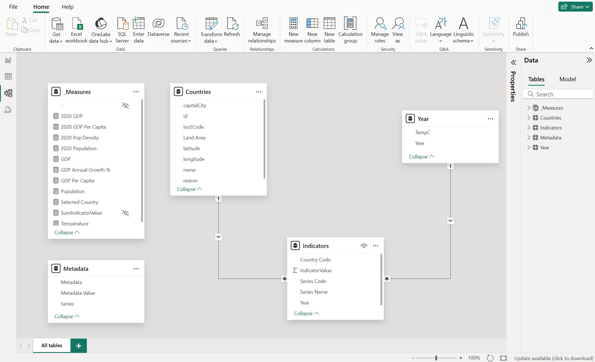
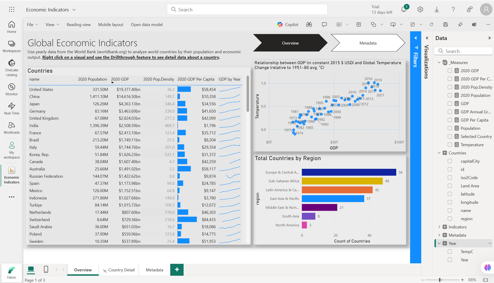
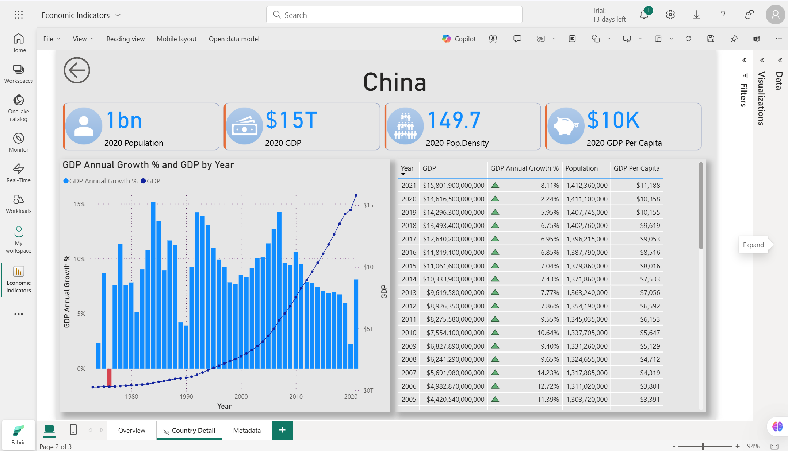
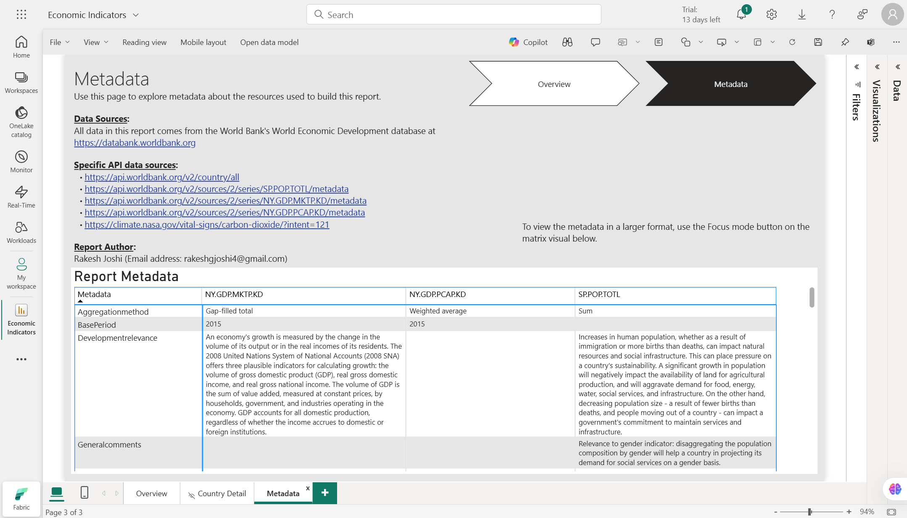

# 🌍 Global Economic Indicators Power BI Dashboard

## 📊 Overview

The **Global Economic Indicators Dashboard** is a Power BI project designed to provide an interactive analysis of key economic metrics across countries and regions. Using data from the **World Bank** and **climate-related datasets**, this dashboard offers insights into **population, GDP, GDP per capita, population density, GDP growth trends,** and correlations between **economic performance and global temperature changes**.

This project is ideal for **policymakers, researchers, and data enthusiasts** seeking to understand global economic trends and their implications.

---

## ✨ Features

### 🔗 Data Model

- A robust relational data model connecting tables for **countries, years, indicators, measures, and metadata**.
- Key relationships enable seamless analysis across multiple dimensions such as **GDP growth, population density, and temperature changes**.
- 📸 **Screenshot**:
  

### 🌐 Global Overview Dashboard

- Interactive visuals summarizing **economic indicators** across countries.
- Scatter plots showing correlations between **GDP (constant 2015 USD)** and **global temperature changes** from 1951–2021.
- Regional breakdown of countries by count.
- 📸 **Screenshot**:
  

### 🎯 Drillthrough Functionality

- 👉 **Right-click** on any **country** in the **Overview dashboard**, then select 'Drill Through' to navigate to its **detailed dashboard** for deeper insights and analysis.

### 🏙️ Country-Specific Dashboards

- Detailed dashboards for individual countries like **India and China**.
- Key metrics displayed prominently:
  - 📈 **Population**
  - 💰 **GDP**
  - 📊 **Population Density**
  - 🔢 **GDP Per Capita**
- 📈 Year-over-year analysis of GDP growth percentages visualized through bar charts and line graphs.
- 📸 **Screenshots**:
  - 
  - 

### 📚 Metadata Tab

- A dedicated section summarizing the **data sources and methodology** used in the project.
- Includes specific **API links** to World Bank datasets and climate-related data sources.
- 📸 **Screenshot**:
  

---

## 📡 Data Sources

- **World Bank Economic Development Database** ([World Bank API](https://datahelpdesk.worldbank.org/knowledgebase/articles/906519-world-bank-apis)):
  - 🌏 **Population**: [SP.POP.TOTL](https://api.worldbank.org/v2/sources/SP.POP.TOTL/metadata)
  - 💵 **GDP**: [NY.GDP.MKTP.KD](https://api.worldbank.org/v2/sources/NY.GDP.MKTP.KD/metadata)
  - 📈 **GDP Per Capita**: [NY.GDP.PCAP.KD](https://api.worldbank.org/v2/sources/NY.GDP.PCAP.KD/metadata)
- **Climate Data** ([NASA Climate Indicators](https://climate.nasa.gov/vital-signs/carbon-dioxide/?intent=121)):
  - 🌡️ **Temperature**: [Vital Signs API](https://climate.nasa.gov/vital-signs/carbon-dioxide/?intent=121)

---

## 🔍 Insights Uncovered

### 🌏 General Insights:

- **Economic Disparities**: Highlights differences in **GDP per capita** across countries and regions.
- **Regional Trends**: Visualizes how various **regions contribute** to global economic output.
- **Climate-Economy Correlation**: Explores trends between **GDP growth** and **global temperature changes** over decades.

### 📈 Specific Country Insights:

- 🇨🇳 **China**:
  - Displayed a remarkable **surge in GDP** from 2000 to 2020, transforming it into one of the world's largest economies.
  - **Population density** has risen alongside economic growth, increasing demand for resources and infrastructure.
- 🇮🇳 **India**:
  - Showed steady **economic growth**, particularly over the last two decades, yet **GDP per capita** remains significantly lower than that of China.
  - **High population density** presents both challenges and opportunities for economic development.
- 🇺🇸 **United States**:
  - Demonstrated consistent **high GDP per capita**, reflecting a highly developed and productive economy.
  - Slower **GDP growth rates** in recent years indicate maturing economic dynamics.
- 🇸🇬 **Singapore**:
  - Exhibits exceptionally **high GDP per capita**, showcasing a highly efficient and advanced economy.
  - The country's **compact size and high population density** have spurred innovation in urban planning and sustainability.

---

## 📝 How to Use

1. 🖥️ **Clone** this repository to your local machine.
2. 📥 **Download** the `.pbix` file (Power BI Desktop file) from the repository.
3. 📂 **Open** the file in Power BI Desktop to interact with the dashboards.
4. 🔍 Use **drillthrough functionality** by right-clicking on a country in the overview to explore its detailed data.

---

## 🤝 Contributing

Contributions are welcome! If you'd like to **improve this project** or add new features:

1. 🍴 **Fork** this repository.
2. 📝 Make your changes in a new branch.
3. 📩 Submit a **pull request** with a description of your updates.

---

## 📜 License

This project is licensed under the **MIT License** - see the [LICENSE](LICENSE) file for details.

---
